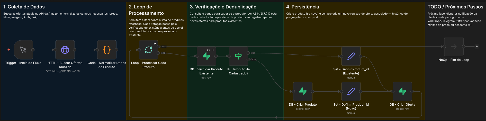

# 🛒 Amazon Ofertas – Workflow n8n

Workflow n8n responsável por buscar ofertas de produtos na Amazon, evitar duplicidade de cadastro e persistir produtos/ofertas em banco de dados.

## 📌 Objetivo

Automatizar a coleta de ofertas da Amazon, cadastrando produtos novos quando necessário e sempre registrando um novo histórico de oferta (preço) para cada execução. Serve como base para uma futura etapa de notificação (WhatsApp/Telegram) quando uma oferta relevante for encontrada.

> ⚠️ **Ambiente de desenvolvimento:** atualmente a API da Amazon está **mockada via [Postman Mock Server](https://learning.postman.com/docs/design-apis/mock-apis/create-mock-server/)**. O node `HTTP - Buscar Ofertas Amazon` aponta para a URL de mock, não para a API real da Amazon. Isso permite desenvolver e testar o fluxo sem depender de credenciais/rate limits da API real. Veja a seção [Mock da API (Postman)](#-mock-da-api-postman) para detalhes.

## 🗺️ Visão Geral do Fluxo



O workflow é dividido em 4 seções lógicas (sinalizadas por sticky notes dentro do n8n):

| Seção | Responsabilidade |
|---|---|
| **1. Coleta de Dados** | Busca as ofertas atuais na API da Amazon e normaliza os campos necessários (preço, título, imagem, ASIN, link). |
| **2. Loop de Processamento** | Itera item a item sobre a lista de produtos retornada pela API. |
| **3. Verificação e Deduplicação** | Consulta o banco para saber se o produto (por ASIN/SKU) já está cadastrado, evitando duplicidade. |
| **4. Persistência** | Cria o produto (caso seja novo) e sempre cria um novo registro de oferta associado — mantendo histórico de preços. |

## 🔧 Nodes principais

| Node | Tipo | Função |
|---|---|---|
| `Trigger - Início do Fluxo` | Trigger | Dispara a execução do workflow |
| `HTTP - Buscar Ofertas Amazon` | HTTP Request | Requisição GET à API de ofertas **(atualmente apontando para mock no Postman)** |
| `Code - Normalizar Dados do Produto` | Code | Trata/normaliza os dados retornados pela API |
| `Loop - Processar Cada Produto` | Split In Batches | Processa os produtos individualmente |
| `DB - Verificar Produto Existente` | Get Row | Verifica se o produto já existe no banco |
| `IF - Produto Já Cadastrado?` | IF | Decide entre reaproveitar ou criar novo produto |
| `Set - Definir Product_id (Existente)` / `(Novo)` | Set | Define o `product_id` a ser usado na oferta |
| `DB - Criar Produto` | Create Row | Cadastra novo produto |
| `DB - Criar Oferta` | Create Row | Registra a oferta (sempre executado) |
| `NoOp - Fim do Loop` | No Operation | Marca o fim da iteração |

## 📁 Estrutura do Repositório

```
amazon-ofertas-n8n/
├── README.md
├── .gitignore
├── workflows/
│   └── amazon-ofertas.json      # JSON exportado do n8n
├── docs/
│   ├── fluxo-amazon-ofertas.png # print do fluxo
│   └── schema.sql               # schema do banco (Supabase), sem dados
└── CHANGELOG.md                 # histórico de alterações do workflow
```

## 🚀 Como importar no n8n

1. Abra o n8n.
2. Vá em **Workflows → Import from File**.
3. Selecione o arquivo `workflows/amazon-ofertas.json`.
4. Reconfigure as credenciais necessárias (API da Amazon e conexão com o banco de dados), já que credenciais **não são exportadas** por segurança.

## 🔑 Credenciais necessárias

- **API Amazon**: atualmente mockada via Postman (ver seção [Mock da API](#-mock-da-api-postman)) — não requer credencial real neste momento.
- **Supabase**: credencial de conexão (URL do projeto + API key ou connection string) configurada no n8n para os nodes `DB - Verificar Produto Existente`, `DB - Criar Produto` e `DB - Criar Oferta`.

> ⚠️ Nunca versione credenciais neste repositório. O `.gitignore` já está configurado para evitar isso.

## 🧪 Mock da API (Postman)

Enquanto o fluxo está em desenvolvimento, a chamada feita pelo node `HTTP - Buscar Ofertas Amazon` **não vai para a API real da Amazon** — ela aponta para um **Postman Mock Server**, que devolve um payload de exemplo com a mesma estrutura esperada da API real (título, preço, ASIN, imagem, link).

**Por quê:** evita depender de credenciais/rate limit da API real durante o desenvolvimento do fluxo, além de permitir simular cenários (ex: produto sem estoque, variação de preço) de forma controlada.

**Como funciona:**
1. A collection do Postman usada para gerar o mock está documentada/exportada (ver `postman/` — se aplicável).
2. O Postman gera uma URL pública de mock (ex: `https://xxxxx.mock.pstmn.io/...`).
3. Essa URL é a que está configurada no node `HTTP - Buscar Ofertas Amazon` dentro do workflow.

**Antes de ir para produção:**
- [ ] Substituir a URL mockada pela URL real da API da Amazon no node `HTTP - Buscar Ofertas Amazon`.
- [ ] Configurar a credencial/autenticação real (chave de API, assinatura de requisição, etc., conforme a integração escolhida).
- [ ] Validar se o payload real da Amazon é 100% compatível com o mock — caso contrário, ajustar o node `Code - Normalizar Dados do Produto`.

> 💡 Se a collection do Postman for exportada para o repositório, salve-a em `postman/amazon-ofertas.postman_collection.json` e adicione essa pasta na estrutura do repositório.

## 🗄️ Banco de Dados (Supabase)

O projeto usa o **Supabase** (PostgreSQL) para persistir produtos e ofertas. A coluna `store` em `products` já prevê expansão futura para outras lojas além da Amazon.

### Estrutura das tabelas

**`products`** — dados fixos do produto

| Coluna | Tipo | Descrição |
|---|---|---|
| `id` | `uuid` (PK) | Identificador interno do produto |
| `external_id` | `text` (UNIQUE) | ID do produto na origem (ex: ASIN da Amazon) — usado para deduplicação |
| `title` | `text` | Título/nome do produto |
| `image` | `text` | URL da imagem do produto |
| `url` | `text` | Link do produto na loja de origem |
| `store` | `text` | Loja de origem (`amazon` por padrão) |
| `created_at` / `updated_at` | `timestamptz` | Controle de auditoria |

**`offers`** — histórico de ofertas/preços, vinculado a um produto

| Coluna | Tipo | Descrição |
|---|---|---|
| `id` | `uuid` (PK) | Identificador interno da oferta |
| `product_id` | `uuid` (FK → `products.id`) | Produto ao qual a oferta pertence |
| `price` | `numeric` | Preço atual capturado |
| `old_price` | `numeric` | Preço anterior (para cálculo de desconto/exibição) |
| `discount` | `integer` | Percentual de desconto |
| `affiliate_url` | `text` | Link de afiliado (usado na futura notificação) |
| `published` | `boolean` | Indica se a oferta já foi publicada (WhatsApp/Telegram) |
| `available` | `boolean` | Indica se o produto está disponível/em estoque |
| `captured_at` | `timestamptz` | Data/hora da captura da oferta |

> 💡 O relacionamento `offers.product_id → products.id` é o que permite manter um histórico de preços por produto: a cada execução do workflow, uma nova linha é inserida em `offers`, sem duplicar o produto em `products` (deduplicação feita por `external_id`).

O schema completo (DDL) está versionado em [`docs/schema.sql`](docs/schema.sql).

### Como exportar o schema para documentar no repositório

O Supabase permite exportar a estrutura do banco (schema) sem exportar os dados, de duas formas:

**Opção 1 — Painel do Supabase (mais simples)**
1. Acesse o [Supabase Dashboard](https://supabase.com/dashboard) → seu projeto.
2. Vá em **Database → Backups** (ou **Database → Schema Visualizer**, dependendo da versão do painel).
3. Utilize a opção de exportar/gerar o schema em SQL.
4. Salve o arquivo como `docs/schema.sql` no repositório.

**Opção 2 — Supabase CLI (mais controle, recomendado)**
```bash
# Instalar a CLI, se ainda não tiver
npm install -g supabase

# Login
supabase login

# Vincular ao projeto (pega o project-ref no dashboard, em Project Settings)
supabase link --project-ref SEU_PROJECT_REF

# Exportar apenas o schema (sem dados)
supabase db dump --schema-only -f docs/schema.sql
```

**Opção 3 — via `pg_dump` direto (se preferir usar a connection string do Postgres)**
```bash
pg_dump --schema-only --no-owner --no-privileges \
  "postgresql://postgres:[SENHA]@[HOST]:[PORTA]/postgres" \
  > docs/schema.sql
```
> ⚠️ Nunca deixe a connection string com senha em texto salva em nenhum arquivo do repositório — use-a só no terminal, direto na hora de rodar o comando.

Depois de gerar o `docs/schema.sql`, adicione-o à estrutura do repositório (veja seção acima) e referencie no `CHANGELOG.md` quando o schema mudar.

## 🔄 Como atualizar o workflow

Como o versionamento é feito via exportação manual do JSON:

1. Faça as alterações no workflow dentro do n8n.
2. Exporte novamente o JSON (**Download**).
3. Substitua o arquivo em `workflows/amazon-ofertas.json`.
4. Adicione uma entrada no `CHANGELOG.md` descrevendo o que mudou.
5. Faça o commit.

## 🧭 Roadmap

- [ ] Substituir mock do Postman pela API real da Amazon.
- [ ] Notificar ofertas relevantes em grupo de **WhatsApp** ou **Telegram**.
- [ ] Filtrar notificações por variação mínima de preço/desconto.
- [ ] Adicionar tratamento de erros/retry na requisição à API da Amazon.
